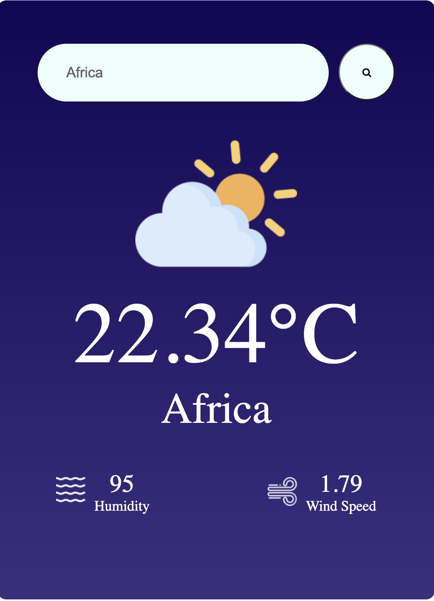

# WeatherNow: Your Ultimate Weather Companion

WeatherNow is a powerful weather app that provides instant and detailed weather information for any location worldwide. With a user-friendly interface, users can quickly access real-time weather data, including current temperature, humidity, and wind speed. 

## Key Features

- **Instant Weather Reports:** Get immediate weather updates by entering your desired location.
- **Comprehensive Insights:** Explore additional details like current temperature, humidity, and wind speed. 
- **Travel Ready:** Stay informed about weather conditions in any city or country for your travel plans.
- **User-Friendly:** Intuitive design for easy navigation, suitable for users of all ages.
- **Reliable Data:** Powered by trusted weather sources from the open weather app api, ensuring accuracy and reliability.

## How to Use

1. Enter the desired location in the search bar.
2. Click "Search" to access detailed weather information.
3. Plan your day with confidence using accurate and up-to-date weather data.

## Getting Started

Clone the repository and open the app in your preferred code editor. Input your API key for weather data and start accessing reliable weather information instantly.

## Screenshots
  
  
